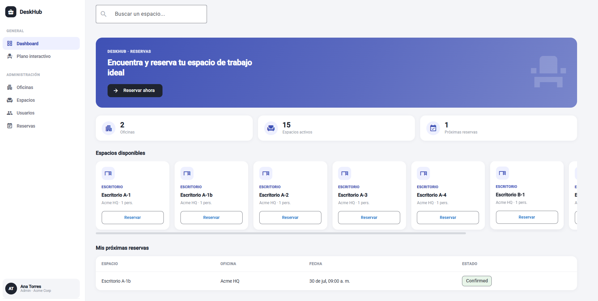
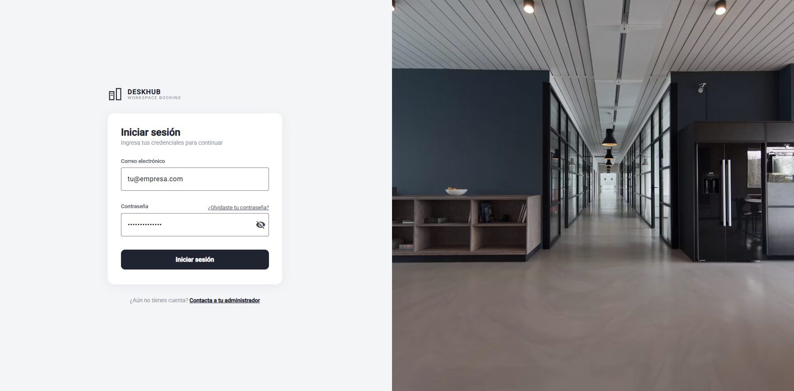
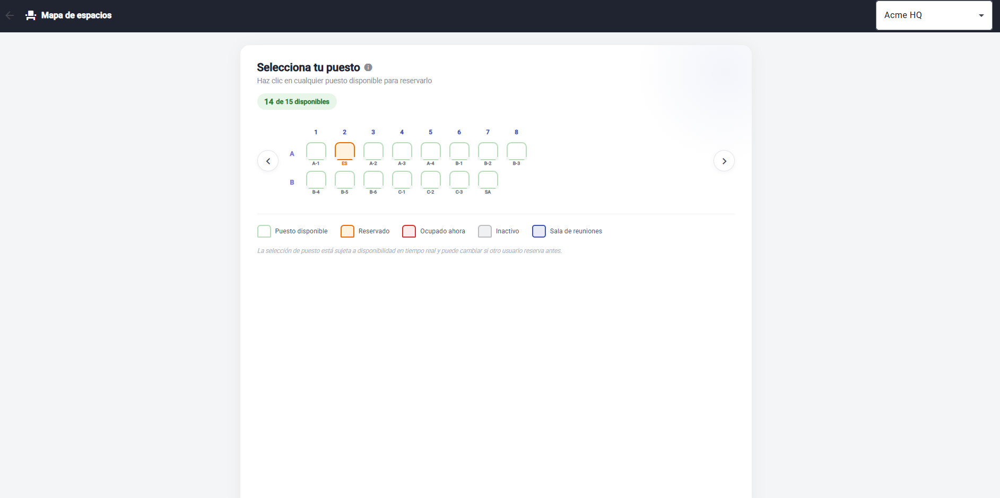
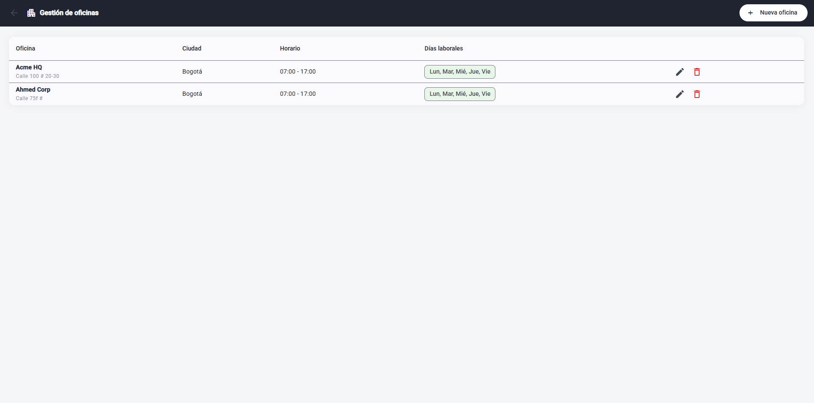

cd /c/Proyectos/DeskHub
cat > README.md << 'READMEEOF'
# DeskHub — Sistema de Reserva de Espacios de Oficina

Sistema **multi-tenant** de gestión y reserva de escritorios/espacios de oficina, pensado para que múltiples empresas clientes gestionen sus propias sedes, espacios y reservas de forma completamente aislada entre sí — el tipo de arquitectura que usan productos SaaS reales como Robin, Envoy u OfficeSpace.



## Demo en vivo

> 🔗 _Próximamente — enlace al deploy_

**Credenciales de prueba:**

| Rol | Email | Password |
|---|---|---|
| Admin | ana@acme.com | temporal123 |
| Employee | pedro@acme.com | temporal123 |

## Índice

- [Características principales](#características-principales)
- [Capturas de pantalla](#capturas-de-pantalla)
- [Stack tecnológico](#stack-tecnológico)
- [Arquitectura](#arquitectura)
- [Instalación local](#instalación-local)
- [Lecciones aprendidas](#lecciones-aprendidas)
- [Roadmap](#roadmap)

## Características principales

- **Autenticación JWT** con contraseñas hasheadas (BCrypt)
- **Multi-tenancy real**: cada empresa cliente ve únicamente sus propios datos (oficinas, usuarios, reservas), aislado a nivel de base de datos mediante EF Core Global Query Filters
- **Autorización granular por rol** (Admin, Manager, Employee) — un Employee solo gestiona sus propias reservas
- **Reglas de negocio reales**: validación de solapamiento de horarios, horario de operación por oficina, días laborales configurables
- **Mapa interactivo de espacios (seatmap)** estilo aerolínea: filas, columnas, estados en tiempo real (disponible / reservado / ocupado / inactivo), reserva con un clic
- **Panel de administración completo**: CRUD de oficinas, espacios, usuarios y reservas, todo desde la interfaz (no solo vía API)
- **Dashboard** con resumen ejecutivo, catálogo de espacios disponibles y próximas reservas del usuario

## Capturas de pantalla

| Login | Dashboard |
|---|---|
|  |  |

| Mapa interactivo | Administración |
|---|---|
|  |  |

## Stack tecnológico

**Backend**
- ASP.NET Core (.NET 10) — Web API
- Entity Framework Core + SQL Server
- JWT (JSON Web Tokens) para autenticación
- BCrypt.Net para hash de contraseñas
- Swashbuckle (Swagger) para documentación de la API

**Frontend**
- Angular 22 (standalone components, signals)
- Angular Material
- RxJS

**Arquitectura**
- Multi-tenancy vía EF Core Global Query Filters
- Autorización basada en roles y claims JWT
- DTOs separados de entidades (sin exponer el modelo de datos directamente)

## Arquitectura
```text

DeskHub/
├── DeskHub.Api/ # Backend ASP.NET Core
│ ├── Controllers/ # Endpoints REST
│ ├── Models/ # Entidades de EF Core
│ ├── DTOs/ # Objetos de transferencia (nunca se exponen entidades directas)
│ ├── Data/ # DbContext + Global Query Filters (multi-tenancy)
│ ├── Services/ # TokenService (JWT)
│ ├── Middleware/ # TenantMiddleware (conecta JWT → CurrentCompanyId)
│ └── Migrations/ # Historial de migraciones EF Core
│
└── deskhub-client/ # Frontend Angular
└── src/app/
├── core/ # Servicios, guards, interceptors, modelos compartidos
└── features/
├── auth/ # Login
├── dashboard/ # Dashboard principal + diálogo de reserva
├── floorplan/ # Seatmap interactivo
└── admin/ # Oficinas, Espacios, Usuarios, Reservas

```

### Modelo de datos (simplificado)
```text

Company (empresa cliente)
└── Office (sede/oficina — horario, días laborales)
└── Space (escritorio o sala de reuniones)
└── Booking (reserva)
└── User (empleado — Role: Admin / Manager / Employee)

```
## Instalación local

### Requisitos previos

- .NET 10 SDK
- Node.js 18+ y npm
- SQL Server (Express o superior)

### Backend

```bash
cd DeskHub.Api
cp appsettings.Development.json.example appsettings.Development.json
# Edita appsettings.Development.json: cadena de conexión y clave JWT
dotnet restore
dotnet ef database update
dotnet run --launch-profile https
```

La API queda disponible en `https://localhost:7290` (Swagger en `/swagger`).

### Frontend

```bash
cd deskhub-client
npm install
ng serve
```

La app queda disponible en `http://localhost:4200`.

### Primeros pasos tras instalar

1. Crea una empresa: `POST /api/Companies`
2. Crea roles: `POST /api/Roles` (Admin, Manager, Employee)
3. Crea una oficina: `POST /api/Offices`
4. Crea tu primer usuario Admin: `POST /api/Users`
5. Inicia sesión desde el frontend y continúa configurando desde la interfaz de administración

## Lecciones aprendidas

Problemas técnicos reales encontrados durante el desarrollo, documentados como referencia.

### 1. Remapeo automático de claims JWT en ASP.NET Core

Al generar un JWT con el claim estándar `sub`, el middleware de autenticación de ASP.NET Core lo remapea automáticamente a `ClaimTypes.NameIdentifier` al validarlo. Leer `sub` directamente desde `HttpContext.User` causaba `ArgumentNullException`. **Solución:** usar `ClaimTypes.NameIdentifier` consistentemente.

### 2. Procesos duplicados de `dotnet run` sirviendo código desactualizado

En Windows con Git Bash, `Ctrl+C` no siempre mata el proceso hijo de `dotnet run`, dejando el puerto ocupado por una versión vieja del backend. **Solución:** verificar procesos activos (`tasklist | grep dotnet`) y matarlos antes de reiniciar.

### 3. Breaking changes en `Microsoft.OpenApi` v2.x

Actualizar `Microsoft.OpenApi` por una vulnerabilidad de seguridad introdujo cambios incompatibles: el namespace `Microsoft.OpenApi.Models` y la propiedad `.Reference` fueron removidos en la v2. **Solución:** usar `OpenApiSecuritySchemeReference` con un lambda en `AddSecurityRequirement`.

### 4. Angular 22 generado sin declarar el polyfill de Zone.js

El proyecto se generó sin `zone.js` en `angular.json > polyfills`, mientras `app.config.ts` usaba `provideZoneChangeDetection`. Causaba pantalla en blanco con error `NG0908`. **Solución:** agregar `"polyfills": ["zone.js"]` en `angular.json`.

### 5. Constraints de FOREIGN KEY con múltiples rutas de cascada en SQL Server

Al agregar multi-tenancy, SQL Server rechazó la migración por detectar dos rutas de cascada al borrar una `Company`. **Solución:** `DeleteBehavior.Restrict` en `User → Company`, `Cascade` solo en `Office → Company`.

### 6. Conversión automática a UTC con `toISOString()` en JavaScript

`Date.toISOString()` convierte automáticamente a UTC según la zona horaria del navegador, desplazando la hora seleccionada por el usuario y generando falsos conflictos de horario. **Solución:** construir el string de fecha/hora manualmente en formato local, sin sufijo de zona horaria.

## Roadmap

- [x] Modelo de datos y CRUD base
- [x] Multi-tenancy con aislamiento de datos
- [x] Autenticación JWT y autorización por roles
- [x] Validación de horarios y días laborales
- [x] Frontend: Login, Dashboard, flujo de reserva
- [x] Frontend: Mapa interactivo de espacios (seatmap)
- [x] Frontend: Panel de administración completo
- [ ] Deploy en vivo
- [ ] Notificaciones por email
- [ ] Reportes de ocupación

---
